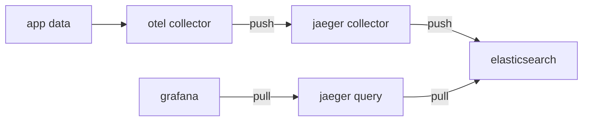
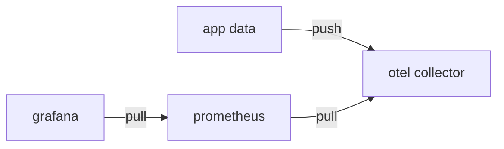
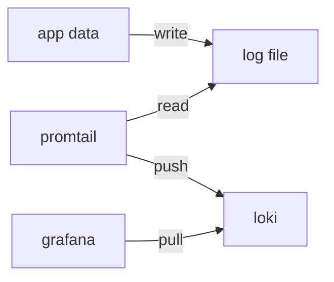

# OpenTelemetry(otel) Demo

> https://opentelemetry.io/docs/languages/go

遥测数据监控三驾马车:

- traces
- metrics
- logs

## 数据流图

### traces



### metrics



### logs



## 服务端口列表

| 端口  | 说明                                    |
| ----- | --------------------------------------- |
| 4317  | OTLP gRPC                               |
| 4318  | OTLP HTTP                               |
| 14250 | Jaeger gRPC                             |
| 14268 | Jaeger HTTP                             |
| 16686 | Jaeger UI                               |
| 9090  | Prometheus UI                           |
| 9200  | Elasticsearch (ES) - HTTP API           |
| 9300  | Elasticsearch (ES) - 集群节点间通信端口 |
| 3000  | Grafana UI                              |

## docker 安装

### standalone 模式

> https://github.com/guobinqiu/otel-demo/tree/main/install/docker/standalone

1. 配置 `install/docker/standalone/otel-config.yml`

```
receivers:
  otlp:
    protocols:
      grpc:
        endpoint: otel-collector:4317 # 通过grpc从app接收遥测数据
      http:
        endpoint: otel-collector:4318 # 通过http从app接收遥测数据
exporters:
  otlp:
    endpoint: jaeger-collector:4317 # 导出到jaeger-collector的gRPC端口
    tls:
      insecure: true
  debug:
  prometheus:
    endpoint: "0.0.0.0:9464" # 让Prometheus来访问这个端口
service:
  pipelines:
    traces:
      receivers: [otlp]
      exporters: [otlp, debug]
    metrics:
      receivers: [otlp]
      exporters: [prometheus]
```

2. 配置 `install/docker/standalone/prometheus.yml`

```
scrape_configs:
  - job_name: 'otel-collector'
    static_configs:
      - targets: ['otel-collector:9464']
```

3. 配置 `install/docker/standalone/loki-config.yaml`

> https://raw.githubusercontent.com/grafana/loki/v3.4.1/cmd/loki/loki-local-config.yaml

```
auth_enabled: false

server:
  http_listen_port: 3100
  grpc_listen_port: 9096
  log_level: debug
  grpc_server_max_concurrent_streams: 1000

common:
  instance_addr: 127.0.0.1
  path_prefix: /tmp/loki
  storage:
    filesystem:
      chunks_directory: /tmp/loki/chunks
      rules_directory: /tmp/loki/rules
  replication_factor: 1
  ring:
    kvstore:
      store: inmemory

query_range:
  results_cache:
    cache:
      embedded_cache:
        enabled: true
        max_size_mb: 100

limits_config:
  metric_aggregation_enabled: true

schema_config:
  configs:
    - from: 2020-10-24
      store: tsdb
      object_store: filesystem
      schema: v13
      index:
        prefix: index_
        period: 24h

pattern_ingester:
  enabled: true
  metric_aggregation:
    loki_address: localhost:3100

ruler:
  alertmanager_url: http://localhost:9093

frontend:
  encoding: protobuf
```

4. 配置 `install/docker/standalone/promtail-config.yaml`

> https://raw.githubusercontent.com/grafana/loki/v3.4.1/clients/cmd/promtail/promtail-docker-config.yaml

```
server:
  http_listen_port: 9080
  grpc_listen_port: 0

positions:
  filename: /tmp/positions.yaml

clients:
  - url: http://loki:3100/loki/api/v1/push

scrape_configs:
- job_name: system
  static_configs:
  - targets:
      - localhost
    labels:
      job: varlogs
      __path__: /var/log/*log
```

5. 配置 `install/docker/standalone/docker-compose.yaml`

> https://raw.githubusercontent.com/grafana/loki/v3.4.1/production/docker-compose.yaml

```
services:
  otel-collector:
    image: ghcr.io/open-telemetry/opentelemetry-collector-releases/opentelemetry-collector-contrib:0.120.0
    container_name: otel-collector
    command: "--config=/etc/otelcol-config.yml"
    volumes:
      - ./otelcol-config.yml:/etc/otelcol-config.yml
    ports:
      - "4317:4317" # OTLP gRPC
      - "4318:4318" # OTLP HTTP
    depends_on:
      - jaeger-collector

  jaeger-collector:
    image: jaegertracing/jaeger-collector:1.66.0
    container_name: jaeger-collector
    environment:
      - SPAN_STORAGE_TYPE=elasticsearch
      - ES_SERVER_URLS=http://elasticsearch:9200
    depends_on:
      - elasticsearch
    restart: always

  jaeger-query:
    image: jaegertracing/jaeger-query:1.66.0
    container_name: jaeger-query
    environment:
      - SPAN_STORAGE_TYPE=elasticsearch
      - ES_SERVER_URLS=http://elasticsearch:9200
    ports:
      - "16686:16686"
    depends_on:
      - elasticsearch
    restart: always

  elasticsearch:
    image: elasticsearch:7.17.28
    container_name: elasticsearch
    environment:
      - discovery.type=single-node
    ports:
      - "9200:9200"
      - "9300:9300"

  prometheus:
    image: prom/prometheus:latest
    container_name: prometheus
    ports:
      - "9090:9090"
    volumes:
      - ./prometheus.yml:/etc/prometheus/prometheus.yml

  loki:
    image: grafana/loki
    container_name: loki
    command: -config.file=/etc/loki/loki-config.yaml
    volumes:
      - ./loki-config.yaml:/etc/loki/loki-config.yaml
    ports:
      - "3100:3100"

  promtail:
    image: grafana/promtail:latest
    container_name: promtail
    command: -config.file=/etc/promtail/config.yml
    volumes:
      - /tmp/log:/var/log
      - ./promtail-config.yaml:/etc/promtail/config.yml

  grafana:
    image: grafana/grafana
    container_name: grafana
    environment:
      - GF_AUTH_ANONYMOUS_ENABLED=true
      - GF_AUTH_ANONYMOUS_ORG_ROLE=Admin
    ports:
      - "3000:3000"
```

jaeger 这里有个巨坑 单机使用badger无法让jaeger-collector和jaeger-query共享存储 后果就是配置没有问题但是 jaeger-query 无论如何看不到 trace 数据 这里使用elasticsearch作为jaeger的后端存储


### all-in-one 模式

> https://github.com/guobinqiu/otel-demo/tree/main/install/docker/allinone

## 二进制安装

### 下载

[otel-collector](https://github.com/open-telemetry/opentelemetry-collector-releases/releases)

[jaeger](https://github.com/jaegertracing/jaeger/releases)

[elasticsearch](https://github.com/elastic/elasticsearch/releases)

[prometheus](https://github.com/prometheus/prometheus/releases)

[loki](https://github.com/grafana/loki/releases)

[grafana](https://github.com/grafana/grafana/releases)

可根据需要自行下载指定版本到bin目录下

1. 配置 `install/otelcol-config.yml`

```
receivers:
  otlp:
    protocols:
      grpc:
        endpoint: localhost:4317 # 通过grpc从app接收遥测数据
      http:
        endpoint: localhost:4318 # 通过http从app接收遥测数据
exporters:
  otlp:
    endpoint: localhost:43170 # 导出到jaeger-collector的gRPC端口
    tls:
      insecure: true
  debug:
  prometheus:
    endpoint: "localhost:9464" # 让Prometheus来访问这个端口
service:
  pipelines:
    traces:
      receivers: [otlp]
      exporters: [otlp, debug]
    metrics:
      receivers: [otlp]
      exporters: [prometheus]
```

2. 配置 `install/prometheus.yml`

```
scrape_configs:
  - job_name: 'otel-collector'
    static_configs:
      - targets: ['localhost:9464']
```

3. 运行 `otel-collector`

```
./bin/otelcol-contrib --config install/otelcol-config.yml
```

4. 运行 `jaeger-collector`

由于 `otel-collector` 默认已经启动在了 `4317` 和 `4318` 端口, 如果在同一台机器上启动 `jaeger-collector` 需要修改otlp对应的端口为 `43170` 和 `43180` 来避免端口冲突

```
export SPAN_STORAGE_TYPE=elasticsearch
export ES_SERVER_URLS=http://localhost:9200
./bin/jaeger-collector \
  --collector.otlp.enabled=true \
  --collector.otlp.grpc.host-port=:43170 \
  --collector.otlp.http.host-port=:43180
```

5. 运行 `jaeger-query`

```
export SPAN_STORAGE_TYPE=elasticsearch
export ES_SERVER_URLS=http://localhost:9200
./bin/jaeger-query
```

## 查看监控

### jaeger

Web UI: http://locahost:16686

`svc-a` 的api `/a` 调用 `svc-b` 的 api `/b` 查看跟踪数据


配置到 `grafana`
1. Add new data source > Connection URL:
   - http://jaeger-query:16686 (standalone)
   - http://jaeger:16686 (all-in-one)
2. Explore view > Query type: Search


### prometheus

Web UI: http://localhost:9090

造数据 10万并发持续访问1分钟

```
wrk -c 100000 -d 1m http://localhost:8081/a
```

http_requests_total


QPS: rate(http_requests_total[1m])


Latency: http_request_duration_seconds_bucket


| `le` 值 | 累计请求数 | 含义 |
|---------|------------|------|
| 0.005   | 8311       | 有 8311 个请求的响应时间 ≤ 5 毫秒 |
| 0.01    | 22375      | 有 22375 个请求的响应时间 ≤ 10 毫秒 |
| 0.025   | 81793      | 有 81793 个请求的响应时间 ≤ 25 毫秒 |
| 0.05    | 110725     | 有 110725 个请求的响应时间 ≤ 50 毫秒 |
| 0.1     | 136150     | 有 136150 个请求的响应时间 ≤ 100 毫秒 |
| 0.25    | 181659     | 有 181659 个请求的响应时间 ≤ 250 毫秒 |
| 0.5     | 183375     | 有 183375 个请求的响应时间 ≤ 500 毫秒 |
| 1.0     | 183375     | 有 183375 个请求的响应时间 ≤ 1000 毫秒 |
| 2.5     | 183375     | 有 183375 个请求的响应时间 ≤ 2500 毫秒 |
| 5.0     | 183623     | 有 183623 个请求的响应时间 ≤ 5000 毫秒 |
| 10.0    | 183623     | 有 183623 个请求的响应时间 ≤ 10000 毫秒 |
| +Inf    | 183623     | 所有请求总数（即总共收到 183623 个 GET 请求） |

配置到 `grafana`
1. Add new data source > Connection URL: http://promethues:9090
2. Explore view > Metric

http_requests_total


QPS: rate(http_requests_total[1m])


Latency: http_request_duration_seconds_bucket


### loki

Web UI: http://localhost:3000

日志写入文件

```
go run svc-a/main.go > /tmp/log/otel-demo.log 2>&1 
```

配置到 `grafana`
1. Add new data source > Connection URL: http://loki:3100
2. Explore view > Filters: {job="varlogs"} |= ``


