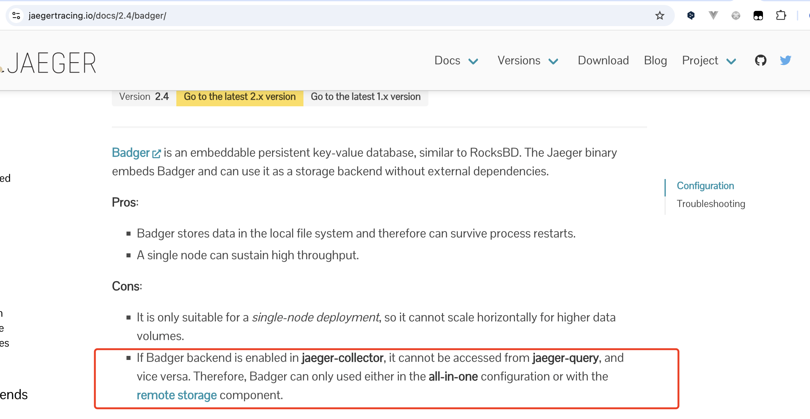
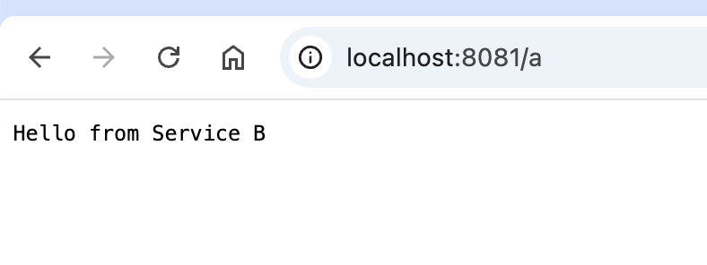
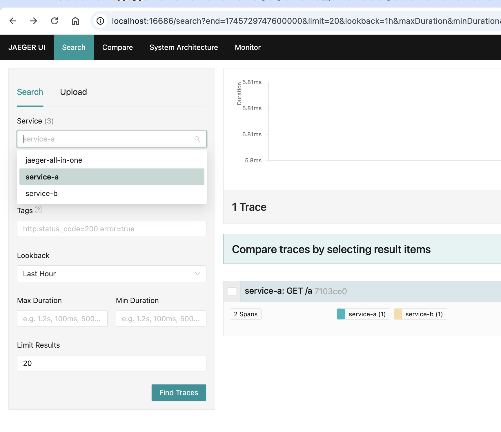
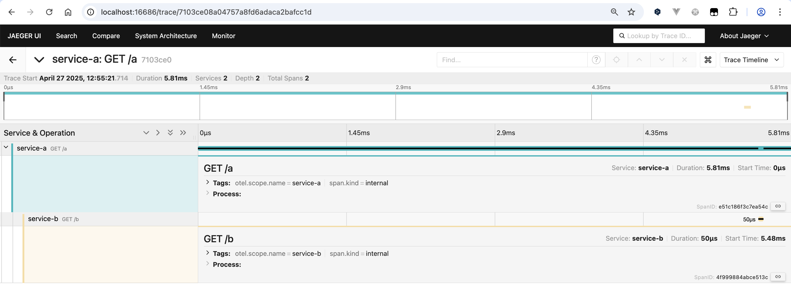

# OpenTelemetry Demo

## TODO LIST

- [x] trace - otel对接jaeger
- [ ] metrics - otel对接prometheus
- [ ] log - otel对接loki

## otel 对接 jaeger

下载otel-collector二进制文件

> https://github.com/open-telemetry/opentelemetry-collector-releases/releases

下载jaeger二进制文件

https://github.com/jaegertracing/jaeger/releases

Note: 你需要自行下载到bin目录下

### 方式一: 二进制文件 all-in-one

```
./bin/jaeger-all-in-one
```

默认服务端口

| 端口  | 说明        |
| ----- | ----------- |
| 4317  | OTLP gRPC   |
| 4318  | OTLP HTTP   |
| 14250 | Jaeger gRPC |
| 14268 | Jaeger HTTP |
| 16686 | Jaeger UI   |

### 方式二: docker all-in-one

otelcol-config-allinone.yml

```
receivers:
  otlp:
    protocols:
      grpc:
        endpoint: otel-collector:4317 # 通过grpc从app接收遥测数据
      http:
        endpoint: otel-collector:4318 # 通过http从app接收遥测数据
exporters:
  otlp:
    endpoint: "jaeger:4317"
    tls:
      insecure: true
  debug:
service:
  pipelines:
    traces:
      receivers: [otlp]
      exporters: [otlp, debug]
```

docker-compose-allinone.yaml

```
services:
  otel-collector:
    image: ghcr.io/open-telemetry/opentelemetry-collector-releases/opentelemetry-collector-contrib:0.120.0
    container_name: otel-collector
    command: "--config=/etc/otelcol-config.yml"
    volumes:
      - ./otelcol-config-allinone.yml:/etc/otelcol-config.yml
    ports:
      - "4317:4317" # OTLP gRPC
      - "4318:4318" # OTLP HTTP
    depends_on:
      - jaeger

  jaeger:
    image: jaegertracing/all-in-one:1.66.0
    container_name: jaeger
    ports:
      - "16686:16686" # Jaeger UI
```

运行

```
docker compose -f docker-compose-allinone.yaml up -d
```

### 方式三: 二进制文件 分开使用各个组件

otelcol-config.yml

```
receivers:
  otlp:
    protocols:
      grpc:
        endpoint: localhost:4317 # 通过grpc从app接收遥测数据
      http:
        endpoint: localhost:4318 # 通过http从app接收遥测数据
exporters:
  otlp:
    endpoint: localhost:43170 # 导出到jaeger-collector的gRPC端口
    tls:
      insecure: true
  debug:
service:
  pipelines:
    traces:
      receivers: [otlp]
      exporters: [otlp, debug]
```

1.运行otel-collector

```
./bin/otelcol-contrib --config otelcol-config.yml
```

2.安装es

不是本篇重点 一行docker命令带过

```
docker run -d --name elasticsearch -p 9200:9200 -p 9300:9300 -e "discovery.type=single-node" elasticsearch:7.17.28
```

Note: 这里有个巨坑 使用badger无法让jaeger-collector和jaeger-query共享存储 后果就是配置没有问题但是 jaeger-query 无论如何看不到 trace 数据



3.运行jaeger-collector

```
export SPAN_STORAGE_TYPE=elasticsearch
export ES_SERVER_URLS=http://localhost:9200
./bin/jaeger-collector \
  --collector.otlp.enabled=true \
  --collector.otlp.http.host-port=:43180 \
  --collector.otlp.grpc.host-port=:43170
```

otel-collector已经默认启动在4317(gRPC)和4318(http)端口, 同一台机器上
jaeger-collector和otel-collector对接的端口需要调整避免端口冲突

同时otel-collector配置更改如下:

```
exporters:
  otlp:
    endpoint: localhost:43170 # 导出到jaeger-collector的gRPC端口
```

4.运行jaeger-query

```
export SPAN_STORAGE_TYPE=elasticsearch
export ES_SERVER_URLS=http://localhost:9200
./bin/jaeger-query
```

### 方式四: docker 分开使用各个组件

otel-config-standalone.yml

```
receivers:
  otlp:
    protocols:
      grpc:
        endpoint: otel-collector:4317 # 通过grpc从app接收遥测数据
      http:
        endpoint: otel-collector:4318 # 通过http从app接收遥测数据
exporters:
  otlp:
    endpoint: jaeger-collector:4317 # 导出到jaeger-collector的gRPC端口
    tls:
      insecure: true
  debug:
service:
  pipelines:
    traces:
      receivers: [otlp]
      exporters: [otlp, debug]
```

docker-compose-standalone.yaml

```
services:
  otel-collector:
    image: ghcr.io/open-telemetry/opentelemetry-collector-releases/opentelemetry-collector-contrib:0.120.0
    container_name: otel-collector
    command: "--config=/etc/otelcol-config.yml"
    volumes:
      - ./otelcol-config-standalone.yml:/etc/otelcol-config.yml
    ports:
      - "4317:4317" # OTLP gRPC
      - "4318:4318" # OTLP HTTP
    depends_on:
      - jaeger-collector

  jaeger-collector:
    image: jaegertracing/jaeger-collector:1.66.0
    container_name: jaeger-collector
    environment:
      - SPAN_STORAGE_TYPE=elasticsearch
      - ES_SERVER_URLS=http://elasticsearch:9200
    depends_on:
      - elasticsearch
    restart: always

  jaeger-query:
    image: jaegertracing/jaeger-query:1.66.0
    container_name: jaeger-query
    environment:
      - SPAN_STORAGE_TYPE=elasticsearch
      - ES_SERVER_URLS=http://elasticsearch:9200
    ports:
      - "16686:16686"
    depends_on:
      - elasticsearch
    restart: always

  elasticsearch:
    image: elasticsearch:7.17.28
    container_name: elasticsearch
    environment:
      - discovery.type=single-node
    ports:
      - "9200:9200"
      - "9300:9300"
```

运行

```
docker compose -f docker-compose-standalone.yaml up -d
```

### 方式五: k8s

operator 安装 otel-collector
> https://github.com/open-telemetry/opentelemetry-operator

operator 安装 jaeger
> https://github.com/jaegertracing/jaeger-operator

### jaeger UI

`svc-a` 的api `/a` 调用 `svc-b` 的 api `/b` 查看跟踪数据







## otel 对接 prometheus

待更新

## otel 对接 loki

待更新